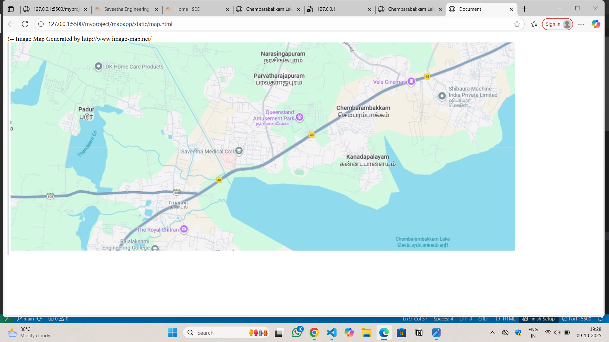
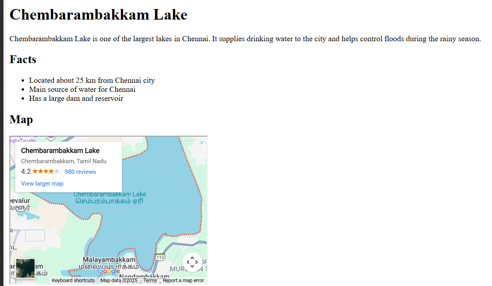
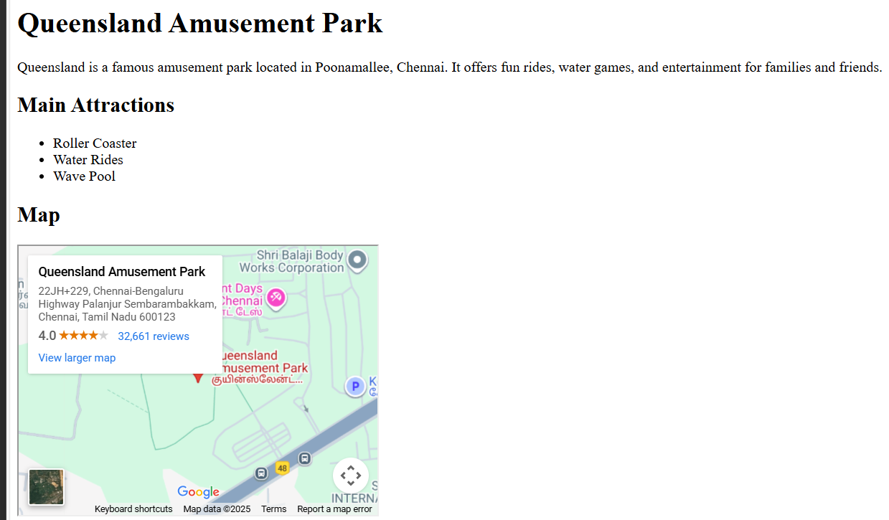
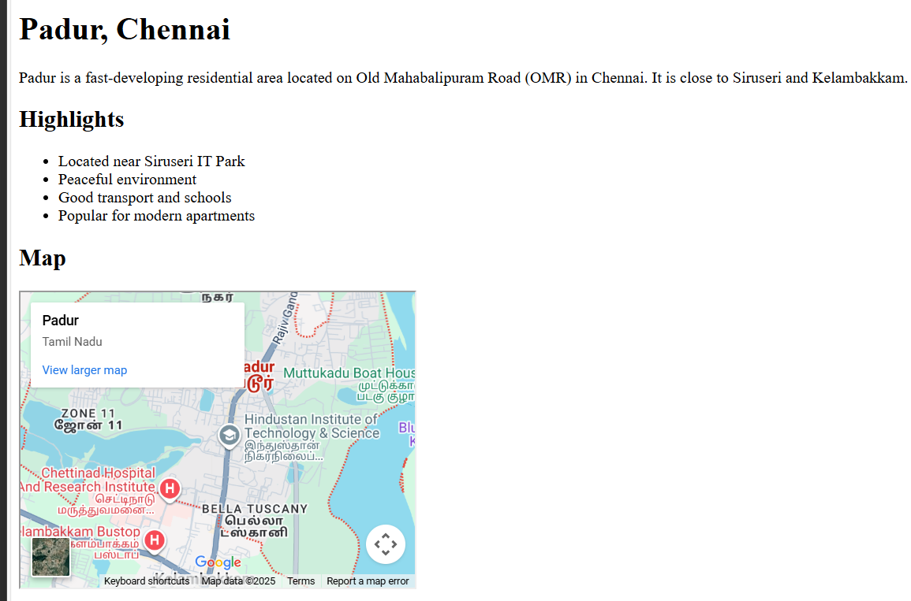
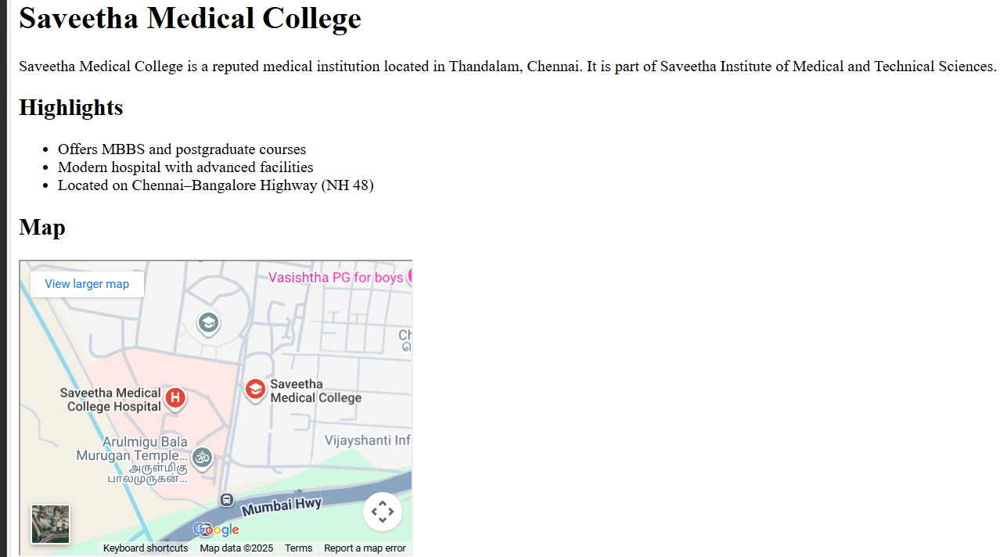
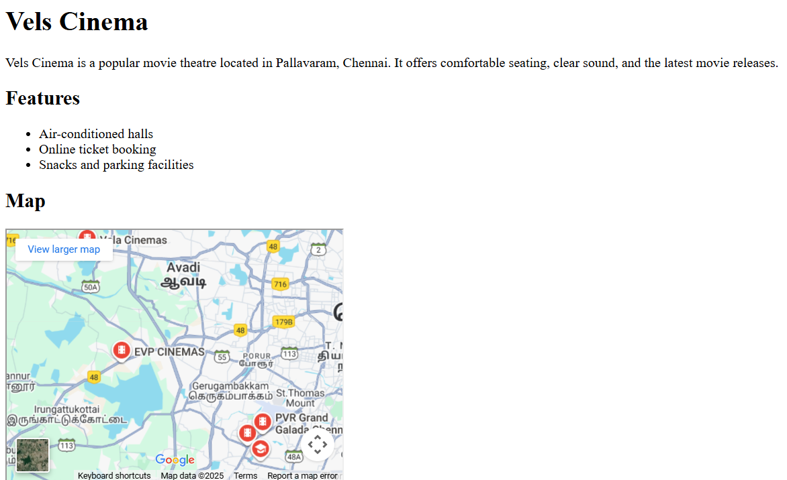

# Ex04 Places Around Me
## Date: 10/12/2025

## AIM
To develop a website to display details about the places around my house.

## DESIGN STEPS

### STEP 1
Create a Django admin interface.

### STEP 2
Download your city map from Google.

### STEP 3
Using ```<map>``` tag name the map.

### STEP 4
Create clickable regions in the image using ```<area>``` tag.

### STEP 5
Write HTML programs for all the regions identified.

### STEP 6
Execute the programs and publish them.

## CODE
```
map.html:
<!DOCTYPE html>
<html lang="en">
<head>
    <meta charset="UTF-8">
    <meta name="viewport" content="width=device-width, initial-scale=1.0">
    <title>Document</title>
</head>
<body>
    <!-- Image Map Generated by http://www.image-map.net/ -->


<map name="image-map">
    <area target="" alt="padur" title="padur" href="padur.html" coords="124,145,268,212" shape="rect">
    <area target="" alt="lake" title="lake" href="lake.html" coords="960,524,1170,526,1057,447,999,469" shape="poly">
    <area target="" alt="park" title="park" href="park.html" coords="672,185,82" shape="circle">
    <area target="" alt="sec" title="sec" href="sec.html" coords="512,275,81" shape="circle">
    <area target="" alt="vels" title="vels" href="vels.html" coords="900,75,1040,142" shape="rect">
</map>
</body>
</html>

lake.html:
<!DOCTYPE html>
<html>
<head>
<title>Chembarambakkam Lake - Chennai</title>
</head>
<body>

<h1>Chembarambakkam Lake</h1>
<p>Chembarambakkam Lake is one of the largest lakes in Chennai. It supplies drinking water to the city and helps control floods during the rainy season.</p>

<h2>Facts</h2>
<ul>
  <li>Located about 25 km from Chennai city</li>
  <li>Main source of water for Chennai</li>
  <li>Has a large dam and reservoir</li>
</ul>

<h2>Map</h2>
<iframe src="https://www.google.com/maps?q=Chembarambakkam+Lake+Chennai&output=embed" width="400" height="300"></iframe>

</body>
</html>


padur.html:
<!DOCTYPE html>
<html>
<head>
<title>Padur - Chennai</title>
</head>
<body>

<h1>Padur, Chennai</h1>
<p>Padur is a fast-developing residential area located on Old Mahabalipuram Road (OMR) in Chennai. It is close to Siruseri and Kelambakkam.</p>

<h2>Highlights</h2>
<ul>
  <li>Located near Siruseri IT Park</li>
  <li>Peaceful environment</li>
  <li>Good transport and schools</li>
  <li>Popular for modern apartments</li>
</ul>

<h2>Map</h2>
<iframe src="https://www.google.com/maps?q=Padur+Chennai&output=embed" width="400" height="300"></iframe>

</body>
</html>


park.html:
<!DOCTYPE html>
<html>
<head>
<title>Queensland Park - Chennai</title>
</head>
<body>

<h1>Queensland Amusement Park</h1>
<p>Queensland is a famous amusement park located in Poonamallee, Chennai. It offers fun rides, water games, and entertainment for families and friends.</p>

<h2>Main Attractions</h2>
<ul>
  <li>Roller Coaster</li>
  <li>Water Rides</li>
  <li>Wave Pool</li>
</ul>

<h2>Map</h2>
<iframe src="https://www.google.com/maps?q=Queensland+Amusement+Park+Chennai&output=embed" width="400" height="300"></iframe>

</body>
</html>


sec.html:
<!DOCTYPE html>
<html>
<head>
<title>Saveetha Medical College - Chennai</title>
</head>
<body>

<h1>Saveetha Medical College</h1>
<p>Saveetha Medical College is a reputed medical institution located in Thandalam, Chennai. It is part of Saveetha Institute of Medical and Technical Sciences.</p>

<h2>Highlights</h2>
<ul>
  <li>Offers MBBS and postgraduate courses</li>
  <li>Modern hospital with advanced facilities</li>
  <li>Located on Chennai–Bangalore Highway (NH 48)</li>
</ul>

<h2>Map</h2>
<iframe src="https://www.google.com/maps?q=Saveetha+Medical+College+Chennai&output=embed" width="400" height="300"></iframe>

</body>
</html>


vels.html:
<!DOCTYPE html>
<html>
<head>
<title>Vels Cinema - Chennai</title>
</head>
<body>

<h1>Vels Cinema</h1>
<p>Vels Cinema is a popular movie theatre located in Pallavaram, Chennai. It offers comfortable seating, clear sound, and the latest movie releases.</p>

<h2>Features</h2>
<ul>
  <li>Air-conditioned halls</li>
  <li>Online ticket booking</li>
  <li>Snacks and parking facilities</li>
</ul>

<h2>Map</h2>
<iframe src="https://www.google.com/maps?q=Vels+Cinema+Pallavaram+Chennai&output=embed" width="400" height="300"></iframe>

</body>
</html>

```

## OUTPUT







## RESULT
The program for implementing image maps using HTML is executed successfully.
